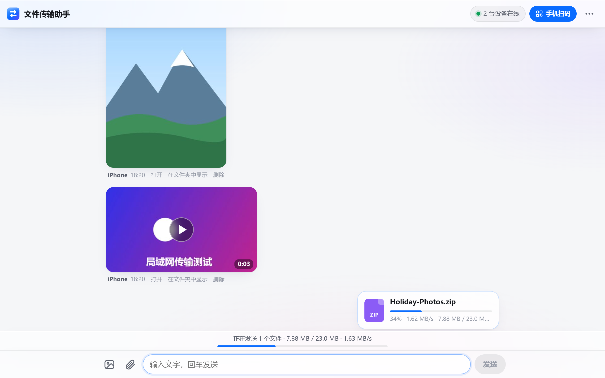
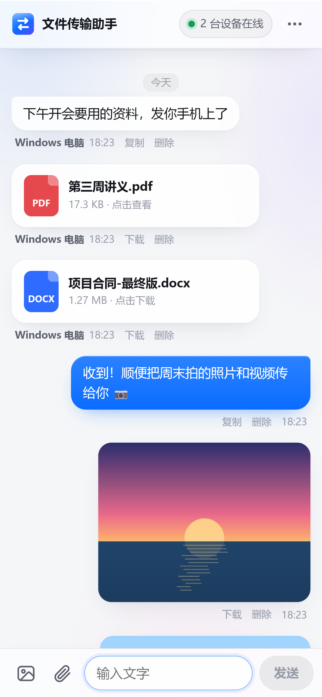

# LAN Transfer (文件传输助手)

Run it on your computer, scan a QR code with your phone, and every phone, tablet and computer on the same Wi-Fi can send each other files, photos, videos and text. Phones don't need an app — a browser is enough. Files go straight across the local network: no server in between, no mobile data used.

[中文说明](README.zh-CN.md) · [Download](https://github.com/haoawake/lan-transfer/releases/latest)

  
  

> The interface is in Chinese.

## Highlights

| | |
|---|---|
| **Fast** | Files are streamed to disk in 16 MB chunks with no intermediary, three files at a time. On loopback the server takes 950 MB/s in and serves 580 MB/s out, so Wi-Fi is always the limit. |
| **Resilient** | A locked phone screen or a Wi-Fi hiccup only costs the chunk in flight; uploads resume automatically. Messages missed while offline are filled in on reconnect. |
| **Compatible** | Any browser works: Safari on iPhone/iPad, stock Android browsers, Chrome, Edge, in-app browsers. The page is plain ES5 + XMLHttpRequest, written for iOS 10 / Android 5 and later. |
| **Two-way** | Phone → computer, computer → phone, phone → phone. All devices stay in sync like a chat. |
| **Photos & video** | Thumbnails are generated automatically; open the original, play video in the browser with seeking, swipe between items. |
| **No install** | One ~8 MB executable. No background service, no system changes. |
| **Access control** | Scanning the QR code logs a device in; typing the address by hand requires a 6-digit code, so others on the same Wi-Fi can't get in. |

## Usage

1. Download from [Releases](https://github.com/haoawake/lan-transfer/releases/latest): `LanTransfer-win-x64.exe` (Windows 10/11), `LanTransfer-mac-arm64.zip` / `mac-x64.zip`, or `LanTransfer-linux-x64.tar.gz` / `linux-arm64`.
2. Run it. A console window opens (closing it quits the app) and your browser shows a QR code. On Windows, allow it through the firewall when asked.
3. Connect your phone to the same Wi-Fi and scan the code with the camera.
4. Send photos, videos, files or text. On the computer you can also drag files onto the page or paste screenshots with Ctrl+V.

Received files are saved to `Downloads/文件传输助手`; the folder and access code can be changed from the ⋯ menu. Other options live in `config.json` under `%AppData%\LanTransfer` (Windows), `~/Library/Application Support/LanTransfer` (macOS) or `~/.config/LanTransfer` (Linux), or can be passed as flags: `-port 9000 -dir D:\Inbox -no-browser`.

**Phone can't open the page?** Make sure both devices are on the same Wi-Fi; on Windows, allow the app through the firewall (or run `netsh advfirewall firewall add rule name="LAN Transfer" dir=in action=allow protocol=TCP localport=8686` as administrator). Campus, office and hotel networks often isolate clients — use your phone's hotspot instead.

## How it works

- A single Go program (standard library plus a QR-code package) with the web page embedded.
- **Upload:** the page slices each file into 16 MB chunks and `POST`s raw bytes to `/api/upload?id=&offset=&size=`; the server appends them to `.incoming/<id>.part` with no multipart parsing and no buffering in memory. After a dropped connection the page first asks `GET /api/upload?id=` how much is on disk and resumes from there; bytes the server already has are skipped rather than rejected, a new request for the same upload preempts a half-dead older one, and connections idle for 30 s are dropped. Finished files are renamed into place, with `(1)`, `(2)` suffixes on name clashes.
- **Download:** `http.ServeContent` with Range support (video seeking, resumable downloads). Links carry an HMAC signature so system download managers that drop cookies still work.
- **Sync:** Server-Sent Events, starting every connection with a full snapshot so reconnects catch up; polling fallback for browsers without SSE.
- **Thumbnails:** generated by the sender's browser with canvas and uploaded alongside, so the computer never decodes images or video.
- **Access:** the host machine's own browser is trusted (with a Host-header check against DNS rebinding); other devices exchange the QR key or the 6-digit code for a cookie. State-changing requests require a custom header, which blocks cross-site request forgery.

Run from source with `go run .`. To release, add notes to the top of `CHANGELOG.md` and push a `v*` tag; GitHub Actions builds every platform and publishes the release.

## License

[MIT](LICENSE)
