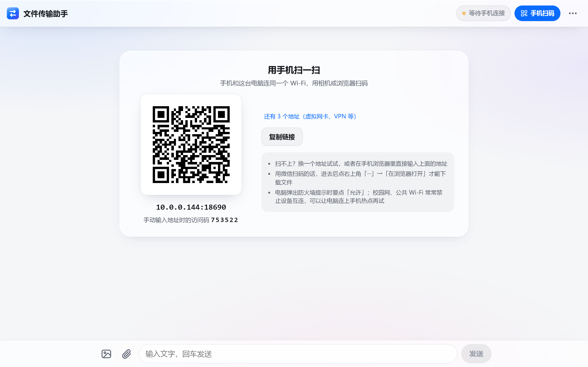

<p align="center"></p>

# 文件传输助手（LAN Transfer）

在电脑上双击运行，用手机扫一下二维码，同一个 Wi-Fi 下的手机、平板、电脑之间就能互传文件、图片、视频和文字。手机不用装 App，用浏览器打开就行。文件直接在局域网里传，不经过任何服务器，也不耗流量。

[English](README.md) · [下载](https://github.com/haoawake/lan-transfer/releases/latest)

<p align="center">
  
  
</p>

## 特点

| | |
|---|---|
| **快** | 文件按 16 MB 一块直接写进硬盘，不经过任何中转，同时传 3 个文件。程序本身在本机回环上能收 950 MB/s、发 580 MB/s，实际速度只受 Wi-Fi 限制。 |
| **稳** | 手机锁屏、Wi-Fi 抖一下都没关系：只重传断掉的那一块，自动接着传。断线期间别的设备发的消息，重连后会自动补上。 |
| **兼容** | 只要有浏览器就行：iPhone / iPad 的 Safari、安卓自带浏览器、Chrome、Edge、各种国产浏览器。网页按 iOS 10、安卓 5 以后的浏览器来写（只用 ES5 和 XMLHttpRequest），老手机也能打开。 |
| **双向** | 手机发电脑、电脑发手机、手机发手机都行。所有设备实时同步，用起来像聊天。 |
| **图片和视频** | 自动生成缩略图，点开看原图、在线播放视频（可以拖进度条），左右滑动切换。 |
| **免安装** | 一个 8 MB 左右的程序，双击就用。没有后台服务，不改系统设置。 |
| **有门禁** | 扫码自动登录；手动输入地址要填 6 位访问码，同一个 Wi-Fi 里的其他人进不来。 |

## 怎么用

1. **下载**（[Releases 页面](https://github.com/haoawake/lan-transfer/releases/latest)）

   | 电脑 | 下载这个 |
   |---|---|
   | Windows 10 / 11 | `LanTransfer-win-x64.exe`（骁龙等 ARM 电脑选 `win-arm64`） |
   | Mac（Apple 芯片） | `LanTransfer-mac-arm64.zip` |
   | Mac（Intel） | `LanTransfer-mac-x64.zip` |
   | Linux | `LanTransfer-linux-x64.tar.gz` / `linux-arm64` |

2. **双击运行。** 会弹出一个黑色窗口（别关它，关了程序就退出了），同时自动打开浏览器，网页上有一个二维码。
   - Windows 第一次运行如果提示「Windows 已保护你的电脑」：点「更多信息」→「仍要运行」。
   - 接着弹出 **Windows 防火墙** 提示时，点「允许访问」，不然手机连不上。
   - Mac：解压后按住 Control 键点按 `LanTransfer` →「打开」。macOS 15 起要先双击一次，再去「系统设置 → 隐私与安全性」点「仍要打开」。

3. **手机连上和电脑相同的 Wi-Fi，用相机或浏览器扫码**，就进来了。

4. **开始传。** 点 🖼 发图片和视频，点 📎 发任意文件，也可以直接打字。电脑上还能把文件拖进网页，或者按 Ctrl + V 粘贴截图。

收到的文件存在电脑的 **「下载 / 文件传输助手」** 文件夹里。网页右上角「···」里可以换文件夹、换访问码。

<p align="center"></p>

### 在手机上保存

- **iPhone**：图片点开后长按 →「添加到照片」。视频点「下载」，再到「文件」App 里打开它 → 分享 →「存储视频」。
- **安卓**：点「下载」，文件在手机的 Download（下载）文件夹，相册里也能看到图片和视频。
- **用微信扫的码**：微信会拦截下载，点右上角「···」→「在浏览器打开」。

## 常见问题

**手机扫码后打不开网页？**

- 确认手机连的是和电脑**同一个 Wi-Fi**，不是在用 4G / 5G 流量。
- **Windows 防火墙**：第一次运行时的提示如果点了「取消」，或者当时的网络被设成了「公用网络」，手机就连不上。用管理员身份打开 PowerShell，运行下面这行放行端口：
  ```
  netsh advfirewall firewall add rule name="文件传输助手" dir=in action=allow protocol=TCP localport=8686
  ```
- **校园网、公司网、酒店和咖啡馆的 Wi-Fi** 通常开了「设备隔离」，同一个网络里的设备也互相访问不了。可以让电脑连上手机热点（或者反过来）再扫码。
- 电脑装了虚拟机或 VPN 时会有好几个地址，点二维码旁边的「还有 N 个地址」换一个试试。

**传得慢？**

速度取决于 Wi-Fi：2.4 GHz 频段一般只有 3–10 MB/s，5 GHz 或 Wi-Fi 6 能到 30–100 MB/s。让手机和电脑都连 5G 频段的 Wi-Fi，离路由器近一点；电脑插网线最好。iPhone 发大视频时 Safari 可能会先显示「正在准备」，那是系统在处理视频，等它走完才开始传。

**传着传着停了？**

手机锁屏或者切到别的 App 时，浏览器会暂停传输，这是手机系统的规定，网页没法绕开。传大文件时让屏幕保持亮着；万一停了，解锁回到浏览器就会自动从断开的地方接着传，不用重新开始。如果提示「电脑硬盘只剩多少」，就在电脑网页的「···」里把接收文件夹换到空间大的盘。

偶尔停几秒又自己接上，一般是 Wi-Fi 断了一下：程序发现卡住后会在几秒内换新连接接着传。电脑上的黑色窗口会记下每次「卡住了一下」，大文件传完时还会显示用时、平均速度和中途卡住的次数。卡得很频繁的话，让手机和电脑都连 5 GHz 的 Wi-Fi、离路由器近一点，电脑能插网线最好。

**怎么换端口、关掉访问码？**

文件夹、访问码可以在网页的设置里改。其他选项在配置文件里：Windows 是 `%AppData%\LanTransfer\config.json`，Mac 是 `~/Library/Application Support/LanTransfer/config.json`，Linux 是 `~/.config/LanTransfer/config.json`。改完重启程序生效。也可以用命令行参数临时指定：

```
LanTransfer-win-x64.exe -port 9000 -dir D:\收到的文件 -no-browser
```

**安全吗？**

- 文件只在局域网里传，程序不连外网。
- 不知道访问码的人看不到你的文件，输错 5 次锁 10 分钟。扫码链接里带着密钥，别把二维码截图发给别人；怀疑泄露了，就在设置里点「换一个」。
- 收到的程序和脚本（`.exe`、`.bat` 等）在电脑上点「打开」时不会直接运行，只会在文件夹里选中它。

## 工作原理

- 一个 Go 写的程序（标准库加一个二维码库），网页打包在程序里。
- **上传**：网页把文件切成 16 MB 一块，`POST /api/upload?id=&offset=&size=`，请求体就是原始字节，服务端直接追加写进 `.incoming/<id>.part`，不做 multipart 解析，也不在内存里攒数据。断线后网页先 `GET /api/upload?id=` 问清楚电脑上有多少，再从那里接着发；重发了电脑上已有的部分就跳过重复字节，不拒绝；同一个上传的新请求会顶掉半死不活的旧连接，30 秒没有数据的连接直接放弃。收齐后改名成正式文件，重名自动加 (1)、(2)。
- **下载**：`http.ServeContent`，支持 Range（视频拖动、断点续传）。链接带 HMAC 签名，不带 cookie 的系统下载器也能下载。
- **实时同步**：Server-Sent Events。每次连上先推一份完整同步，所以断线重连会自动补齐。不支持 SSE 的浏览器退回到轮询。
- **缩略图**：发送方的浏览器用 canvas 生成后上传，电脑不用解码图片和视频。
- **访问控制**：本机打开网页免登录（同时校验 Host 头，防 DNS 重绑定）；其他设备凭扫码链接里的密钥或 6 位访问码换一个 cookie。改动类请求必须带自定义头，挡住跨站请求伪造。

从源码运行：

```
go run .
```

发新版：在 `CHANGELOG.md` 顶部写好说明，推送 `v*` 标签，GitHub Actions 会构建各平台的程序并发布 Release。

## 许可

[MIT](LICENSE)
